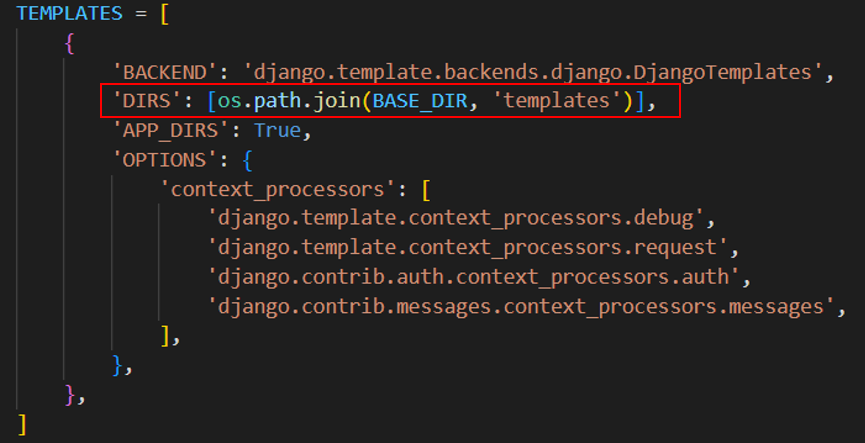

<table>
    <theader>
        <tr>
            <td></td>
            <th>
                UNIVERSIDAD NACIONAL DE SAN AGUSTIN 
                FACULTAD DE INGENIERÍA DE PRODUCCIÓN Y SERVICIOS 
                DEPARTAMENTO ACADÉMICO DE INGENIERÍA DE SISTEMAS E INFORMÁTICA 
                ESCUELA PROFESIONAL DE INGENIERÍA DE SISTEMAS
            </th>
            <td></td>
        </tr>
    </theader>
    <tbody>
        <tr><td colspan="3">Formato: Guía de Práctica de Laboratorio</td></tr>
        <tr><td>Aprobación:  2022/03/01</td><td>Código: GUIA-PRLD-001</td><td>Página: 1</td></tr>
    </tbody>
</table>

INFORME DE LABORATORIO 

<table>
<theader>
<tr><th colspan="6">INFORMACIÓN BÁSICA</th></tr>
</theader>
<tbody>
<tr><td>ASIGNATURA:</td><td colspan="5">Programación Web 2</td></tr>
<tr><td>TÍTULO DE LA PRÁCTICA:</td><td colspan="5">Django</td></tr>
<tr>
<td>NÚMERO DE PRÁCTICA:</td><td>06</td><td>AÑO LECTIVO:</td><td>2022 A</td><td>NRO. SEMESTRE:</td><td>III</td>
</tr>
<tr>
<td>FECHA INICIO::</td><td>30-Jun-2022</td><td>FECHA FIN:</td><td>03-Jul-2022</td><td>DURACIÓN:</td><td>04 horas</td>
</tr>
<tr><td colspan="6">INTEGRANTES:
    <ul>
        <li>Durand Obando, Eduardo Franshua</li>
        <li>Tejad Lazo, Jordy Rolando</li>
        <li>Hurtado Bejarano, Michael Steve</li>
        <li>Chua Aguilar, Jean Carlo Leonel</li>
    </ul>
</td>
</<tr>
<tr><td colspan="6">DOCENTES:
<ul>
<li>Richart Smith Escobedo Quispe - rescobedoq@unsa.edu.pe</li>
</ul>
</td>
</<tr>
</tdbody>
</table>

# Django

[![License][license]][license-file]
[![Downloads][downloads]][releases]
[![Last Commit][last-commit]][releases]

[![Debian][Debian]][debian-site]
[![Git][Git]][git-site]
[![GitHub][GitHub]][github-site]
[![Vim][Vim]][vim-site]
[![Java][Java]][java-site]

#

## LABORATORIO ENCARGADO
-   Adapte las vistas estáticas de su sistema web al Framework de Django. 

#

## RESOLUCIÓN
#
1) Creación del directorio Apps para las aplicaciones que servirán como vistas para la barra de navegación de nuestra página web.

    
    Barra de Navegación
#
2) Creación de las aplicaciones para las vistas.

    

    Directorio y aplicaciones
#
3) Se creó la carpeta templates para las plantillas de las vistas y la carpeta static para almacenar los archivos estáticos y se cambió la ruta de los templates.

    

    Directorio de plantillas

    

    Cambio de ruta de templates
    #
    3.1) Se cambió la configuración de setting de SL_TECHNOLOGY para poder usar la carpeta de archivos estáticos.
    
    #
    3.2) Se agregaron los archivos complementarios dentro de la carpeta static, y luego se ejecutó el comando 'python manage.py collectstatic' para que los archivos puedan ser usados.
#
4) Los procedimientos indicados a continuación fueron repetidos para todas las apps (inicio, accessories, laptops, etc)
    
    #
    4.1) Se modificó la clase inicioConfig de cada aplicación para que funcione dentro del directorio Apps.
        
    

    Cambio en name

    #
    4.2) Se creó las funciones para las vistas dentro de views.py.
        
    

    #
    4.3) Se creo el archivo urls.py para cada aplicación y así poder usarla independientemente para cada proyecto de Django.

    
    En la función render se manda el nombre del html que ocupará la vista de la aplicación, este html se encuentra dentro de nuestra carpeta templates.

    #

    4.4) En el archivo settings.py de SL_TECHNOLOGY se instalaron las aplicaciones agregándolas en la lista de APPS.
    
    

    #

    4.5) En el archivo urls.py de SL_TECHNOLOGY se agregaron las urls de cada aplicación creada.

    

5) Luego de tener las vistas ya implementadas se tuvo que cambiar las rutas de las imágenes, css, js, entre otros archivos que permitían la correcta visualización de la página. Esto se realizó en los archivos html dentro del directorio templates.

## REFERENCIAS
-   https://www.w3schools.com/python/python_reference.asp
-   https://docs.python.org/3/tutorial/
-   https://developer.mozilla.org/es/docs/Learn/Server-side/Django/Models
-   https://tutorial.djangogirls.org/es/django_models/
-   https://pear.php.net/manual/en/standards.php
-   https://docs.djangoproject.com/en/4.0/
-   https://www.youtube.com/watch?v=M4NIs4BM1dk
-   https://pypi.org/
-   https://pip.pypa.io/en/latest/user_guide/
-   https://packaging.python.org/en/latest/tutorials/installing-packages/

#

[license]: https://img.shields.io/github/license/rescobedoq/pw2?label=rescobedoq
[license-file]: https://github.com/rescobedoq/pw2/blob/main/LICENSE

[downloads]: https://img.shields.io/github/downloads/rescobedoq/pw2/total?label=Downloads
[releases]: https://github.com/rescobedoq/pw2/releases/

[last-commit]: https://img.shields.io/github/last-commit/rescobedoq/pw2?label=Last%20Commit

[Debian]: https://img.shields.io/badge/Debian-D70A53?style=for-the-badge&logo=debian&logoColor=white
[debian-site]: https://www.debian.org/index.es.html

[Git]: https://img.shields.io/badge/git-%23F05033.svg?style=for-the-badge&logo=git&logoColor=white
[git-site]: https://git-scm.com/

[GitHub]: https://img.shields.io/badge/github-%23121011.svg?style=for-the-badge&logo=github&logoColor=white
[github-site]: https://github.com/

[Vim]: https://img.shields.io/badge/VIM-%2311AB00.svg?style=for-the-badge&logo=vim&logoColor=white
[vim-site]: https://www.vim.org/

[Java]: https://img.shields.io/badge/java-%23ED8B00.svg?style=for-the-badge&logo=java&logoColor=white
[java-site]: https://docs.oracle.com/javase/tutorial/

[![Debian][Debian]][debian-site]
[![Git][Git]][git-site]
[![GitHub][GitHub]][github-site]
[![Vim][Vim]][vim-site]
[![Java][Java]][java-site]

[![License][license]][license-file]
[![Downloads][downloads]][releases]
[![Last Commit][last-commit]][releases]